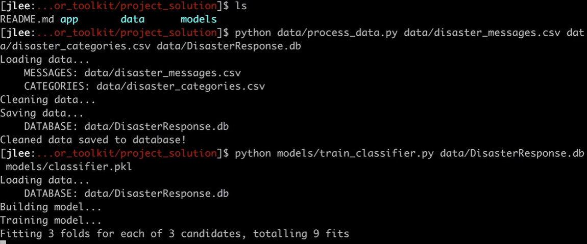

## 项目相关：

### 项目要求：

> 机器学习有力地帮助了各种组织了解哪些消息和它们相关，哪些消息优先级更高，灾害期间是他们最需要过滤大量消息，并找到关键信息的时候。

1. 搭建一个ETL管道：
   1. 搭建一个ETL管道处理来自`Figure 8`的灾害消息；
   2. 并将`CSV`文件中的数据分类；
   3. 把数据加载到**SQLite数据库**中。
2. 搭建一个机器学习管道：
   1. 从数据库中读取数据；
   2. 创建和保存**多输出的监督学习模型**；
3. 搭建一个网络应用程序：
   1. 从数据库中提取数据进行**数据可视化**；
   2. 使用模型将消息分类成**36类**；

-----------------------------

#### 1.ETL 管道

在 Python 脚本 `process_data.py` 中，编写一个数据清洗管道，实现：

- 加载 `messages` 和 `categories` 数据集
- 将两个数据集进行合并 (merge)
- 清洗数据
- 将其存储到 SQLite 数据库中

> 使用`pandas`实现数据清洗。并配合`SQLAlchemy`引擎使用，将数据加载到SQLite数据库中。

#### 2.机器学习管道

在 Python 脚本 `train_classifier.py` 中编写机器学习管道，实现：

- 从 `SQLite` 数据库中加载数据
- 将数据集分成训练和测试集
- 搭建文本处理和机器学习管道
- 使用 `GridSearchCV` 对模型进行训练和微调
- 输出测试集的结果
- 将最终的模型输出为 `pickle` 文件

> 使用`NLTK`和`scikit-learn`的`pipeline`和`GridSearchCV`方法搭建一个机器学习管道，最后输出一个模型。改模型使用`message`列从36个类别中进行多分类输出。

#### 3.Flask 网络应用程序

我们为你提供了 `Flask` 网络应用程序的大部分代码，你可以根据你学的 `Flask 、HTML、CSS` 和 `JavaScript` 知识自由地添加新特征。在本部分，你需要：

- 按需要修改数据库和模型的文件路径
- 使用 `Poltly` 向网络应用程序中添加数据可视化我们提供了一份示例代码给你。

----------------

### 知识背景：

#### `pickle`：

1. **能够保存和加载几乎任何`Python`数据对象。**

> 该模块可以序列化对象并保存到磁盘中，并在需要的时候读取出来，任何对象都可以执行序列化操作。

2. 使用`dump（）`保存数据，在以后某个时间使用`load（）`恢复数据。
3. *处理数据的唯一要求是：必须以二进制访问模式打开这些数据（ 即使用`’wb‘`的模式打开数据）。*
4. 如果在处理数据中出现异常，`pickle`模块会产生一个`PickleError`错误。

Pickle模块中最常用的函数为：

（1）pickle.dump(obj, file, [,protocol])

​    函数的功能：将obj对象序列化存入已经打开的file中。

​    参数讲解：

- obj：想要序列化的obj对象。
- file:文件名称。
- protocol：序列化使用的协议。如果该项省略，则默认为0。如果为负值或HIGHEST_PROTOCOL，则使用最高的协议版本。

（2）pickle.load(file)

​    函数的功能：将file中的对象序列化读出。

​    参数讲解：

- file：文件名称。

（3）pickle.dumps(obj[, protocol])

​    函数的功能：将obj对象序列化为string形式，而不是存入文件中。

​    参数讲解：

- obj：想要序列化的obj对象。
- protocal：如果该项省略，则默认为0。如果为负值或HIGHEST_PROTOCOL，则使用最高的协议版本。

（4）pickle.loads(string)

​    函数的功能：从string中读出序列化前的obj对象。

​    参数讲解：

- string：文件名称。

   【注】 dump() 与 load() 相比 dumps() 和 loads() 还有另一种能力**：**dump()函数能一个接着一个地将几个对象序列化存储到同一个文件中，随后调用load()来以同样的顺序反序列化读出这些对象。

#### `GridSearchCV`（网格搜索）:

> 　GridSearchCV的名字其实可以拆分为两部分，GridSearch和CV，即网格搜索和交叉验证。这两个名字都非常好理解。网格搜索，搜索的是参数，即在指定的参数范围内，按步长依次调整参数，利用调整的参数训练机器学习模型，从所有的参数中找到在验证集上精度最高的参数，这其实是一个训练和比较的过程。
>
> 　　*GridSearchCV可以保证在指定的参数范围内找到精度最高的参数，但是这也是网格搜索的缺陷所在，他要求遍历所有可能参数的组合，在面对大数据集和多参数的情况下，非常耗时。*

#### `Plotly`：

> Plotly 是一款用来做数据分析和可视化的在线平台，功能非常强大,可以在线绘制很多图形比如条形图、散点图、饼图、直方图等等。而且还是支持在线编辑